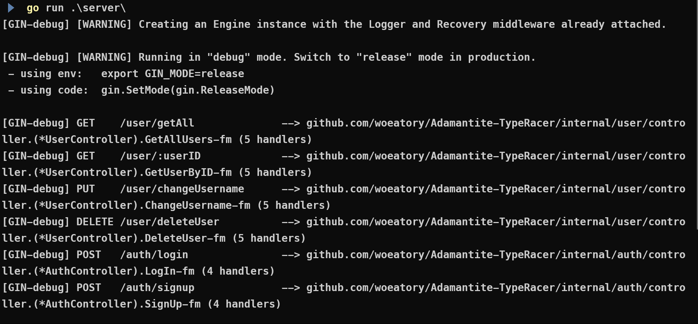
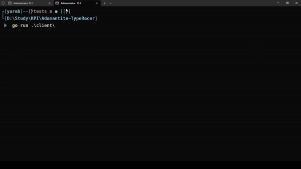

# Adamantite-TypeRacer

CLI-based typing game

Features:

- single/multiplayer
- creating public/private rooms to compete with other players
- saving results in database

[**List of Endpoints**](./info/endpoints.md)


# Deployed on Render.com

https://adamantite-type-racer.onrender.com

# How to start app

#### Install dependencies

```bash
go mod tidy
```

### Boot server with
```bash
go run .\server\
```




### Start CLI client

```bash
go run .\client\
```

